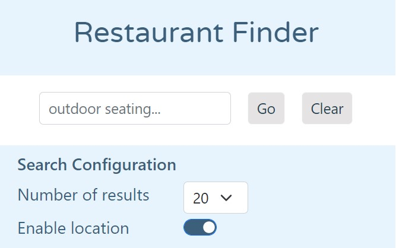
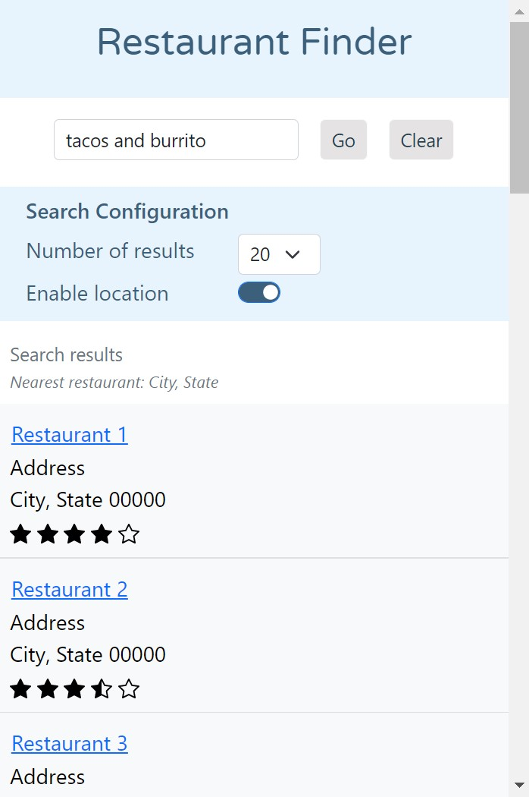
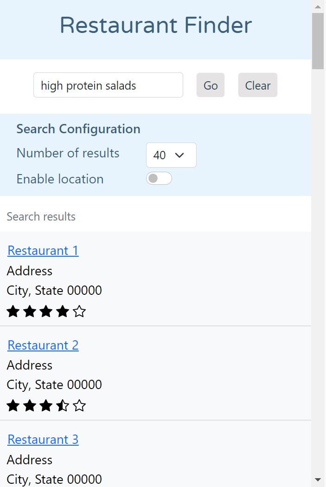

<h1 align="center">Restaurant Finder</h1>
<div align="center">A Chrome extension to search restaurants based on user query.</div>
<br />
<div align="center">
<span></span>
<span></span>
<span></span>
</div>
<br />

## Setup
Download yelp dataset from https://www.yelp.com/dataset and extract it.

### Install required packages
```commandline
pip install -r requirements.txt
```

### Filter and prepare restaurant dataset for indexing
This has to be done one time only.
```commandline
cd restaurant_finder
python dataset.py -p <path-of-dataset>
```
Check [Usage of dataset.py](#usage-of-datasetpy) for custom configuration

## Running Restaurant Finder
The app runs on localhost at port 8080.
```commandline
python app.py
```

## Get list of restaurants based on query
Invoke a GET request or just browse at path '/find' with query parameter 'q' and your restaurant search query as its value.
Response to the find API will be returned in JSON format.
```commandline
http://localhost:8080/find?q=<search-query>
```

## Usage of dataset.py
```commandline
$ python dataset.py --help

usage: dataset.py [-h] -p DATASET_DIRPATH [--review-limit REVIEW_LIMIT]
                  [--review-length-limit REVIEW_LENGTH_LIMIT] [--skip-clean]

Filter dataset

optional arguments:
  -h, --help            show this help message and exit
  -p DATASET_DIRPATH, --dataset-dirpath DATASET_DIRPATH
                        Full dataset path
  --review-limit REVIEW_LIMIT
                        Review limit per restaurant, default=100
  --review-length-limit REVIEW_LENGTH_LIMIT
                        Review char length limit, default=5000
  --skip-clean          Skip cleaning of existing filtered dataset
``` 
